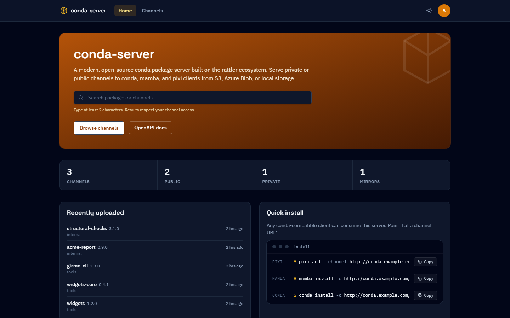
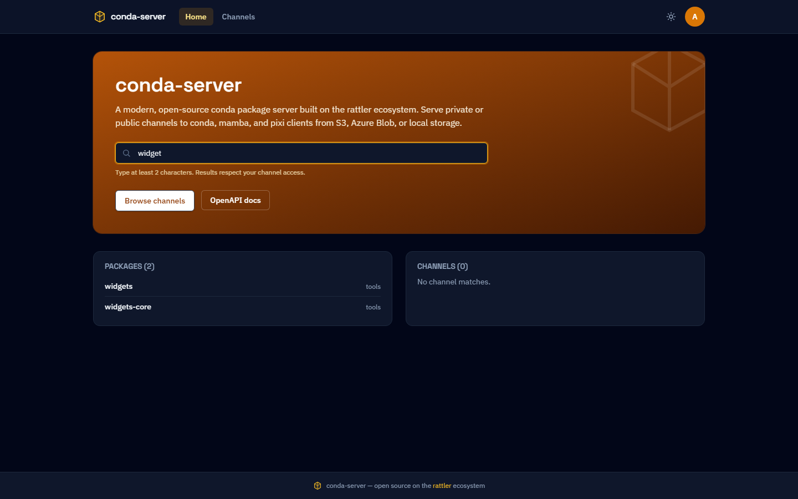
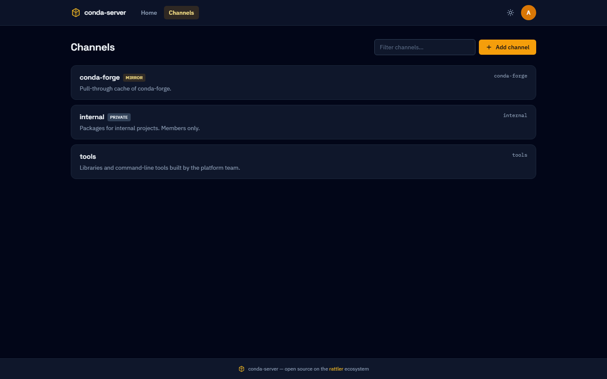
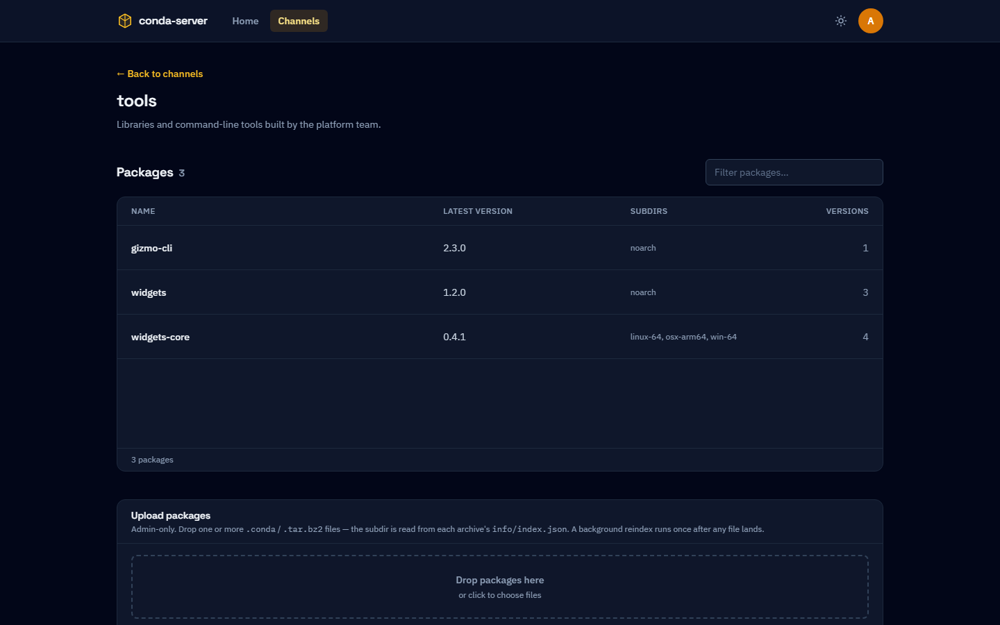
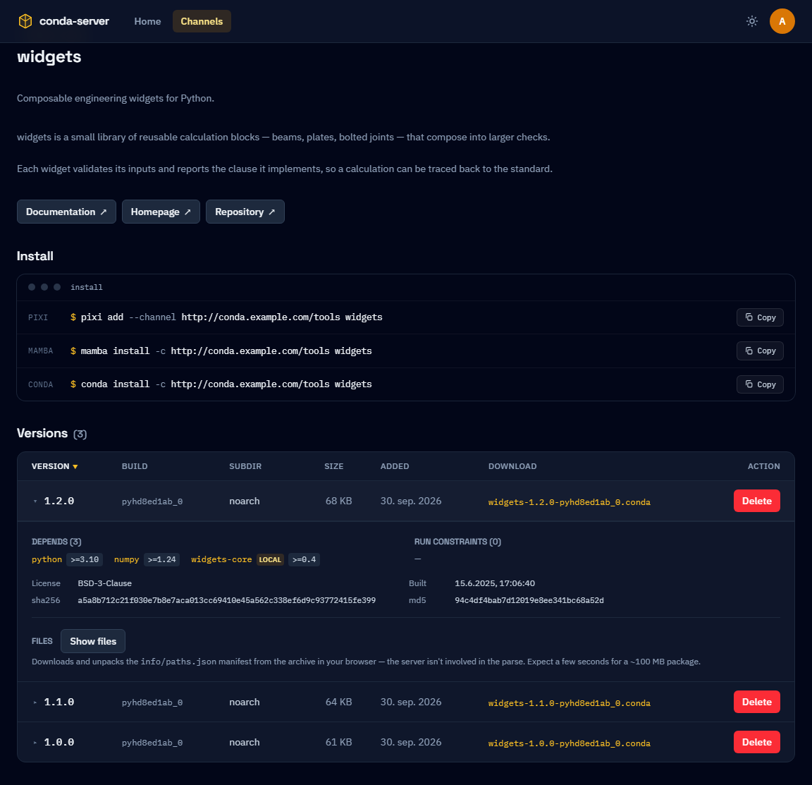
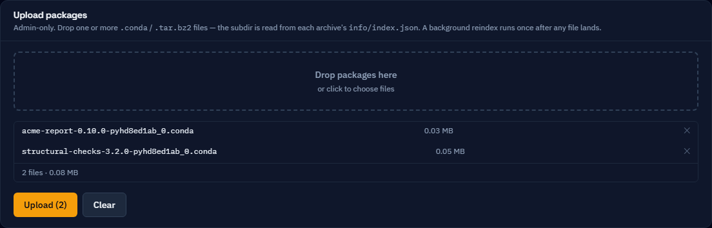
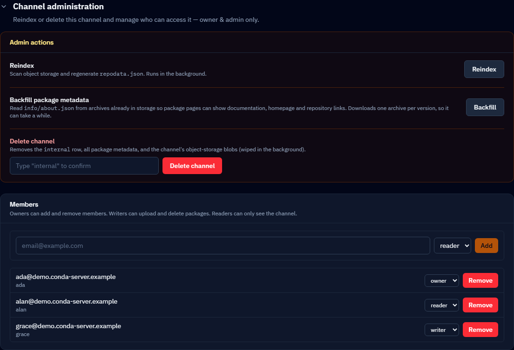
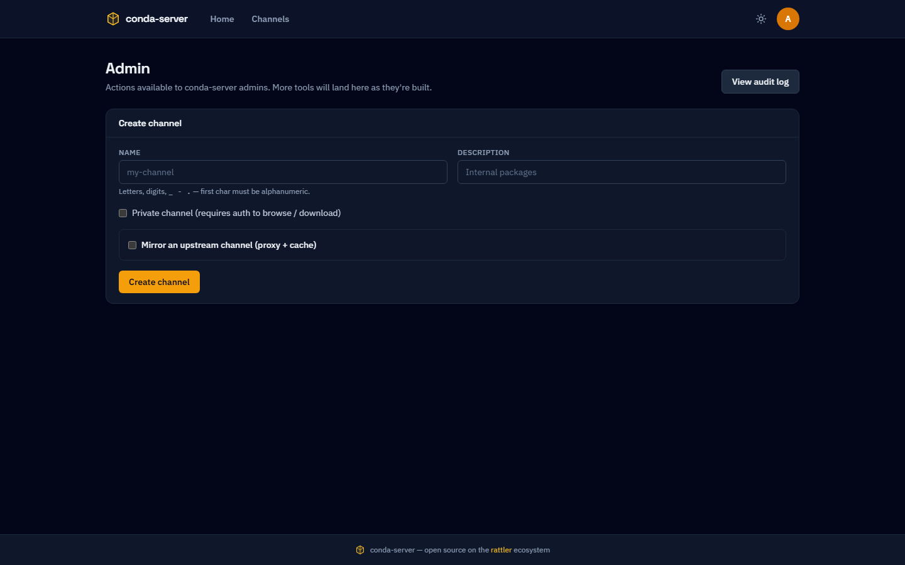
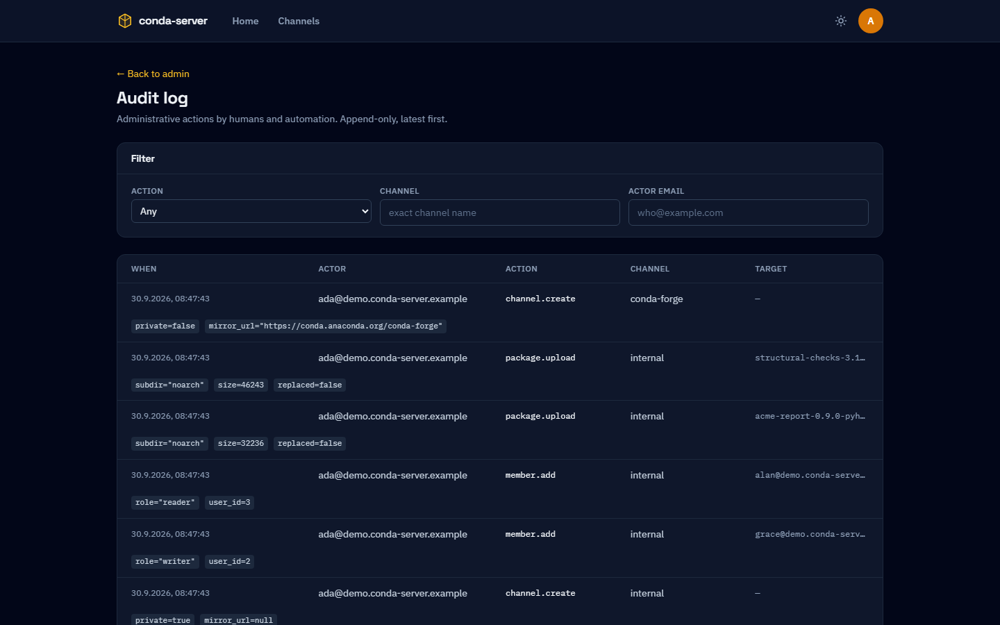
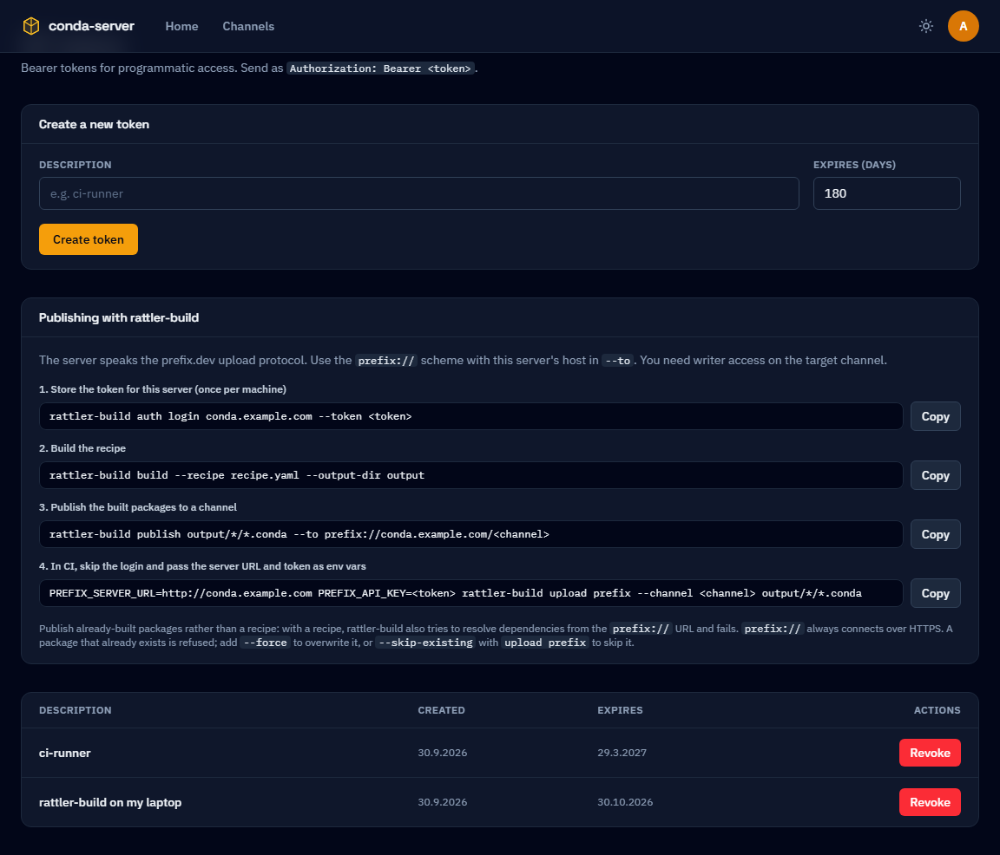

# conda-server

A modern, open-source conda package server built on the [rattler](https://github.com/conda/rattler) ecosystem.

**Status:** early development — API and data model are not yet stable.



This README is about *using* conda-server — finding, installing and publishing
packages. Running an instance, configuring it, and working on the code are in
[DEVELOPERS.md](./DEVELOPERS.md).

## What it does

- Serves `repodata.json` and `.conda` packages over HTTP for any `conda` / `mamba` / `pixi` client.
- Stores package bytes in pluggable object storage (S3, Azure Blob, GCS, or local filesystem).
- Indexes packages using [`py-rattler`](https://github.com/conda/rattler) and [`rattler-index`](https://github.com/conda/rattler) — no `conda-build` dependency.
- Public and private channels, per-channel roles, and pull-through mirrors of upstream channels.
- Publishing from the browser, or from `rattler-build` over the prefix.dev upload protocol.
- OIDC login (GitHub, Google, Azure AD, generic) and bearer tokens for CLI/CI.
- Ships as a single Docker image; scales horizontally behind any standard reverse proxy.

The screenshots below are generated from a demo instance by
`pixi run ui-stories` (see [DEVELOPERS.md](./DEVELOPERS.md#readme-screenshots)),
so they show the interface as it currently is.

## Finding packages

The search box on the landing page matches package and channel names across
every channel you can read. Anonymous visitors see public channels only;
signing in adds the private channels you are a member of.



**Channels** lists every channel you can see. A channel is *public* (anyone
can read it, signed in or not), *private* (members only), or a *mirror* of an
upstream channel.



A channel's page lists its packages, and ends with the commands to install
from it.



A package's page shows the summary, description and links from the package's
own `about.json`, the install command, and every build. Expanding a build
shows its dependencies, license and build date, and can list the files inside
the archive.



## Installing from a channel

A channel's URL is the server's URL plus the channel name, so any
conda-compatible client can use it:

```bash
pixi add --channel https://conda.example.com/tools widgets
mamba install -c https://conda.example.com/tools widgets
conda install -c https://conda.example.com/tools widgets
```

For a **private** channel the client has to authenticate. Mint an API token
(see [API tokens](#api-tokens)) and store it for the host once per machine:

```bash
pixi auth login conda.example.com --token <token>
```

pixi and rattler-build then send it as a bearer token with every request to
that host.

## Publishing packages

You need **writer** access on the channel (see [Channels and access](#channels-and-access)).

### From the browser

Drop one or more `.conda` or `.tar.bz2` archives on the **Upload packages**
card on the channel's page. The server reads the platform from each archive's
`info/index.json`, so the client doesn't choose where a file goes. A package
is listed in `repodata.json` by the time the upload reports success.



### With rattler-build

The server accepts uploads over the prefix.dev protocol at
`/api/v1/upload/<channel>`, so rattler-build can publish to it with the
`prefix://` scheme. Mint an API token under **API tokens** in the web UI,
then:

```bash
rattler-build auth login conda.example.com --token <token>
rattler-build build --recipe recipe.yaml --output-dir output
rattler-build publish output/*/*.conda --to prefix://conda.example.com/<channel>
```

In CI, skip the login and pass the server and token as env vars:

```bash
PREFIX_SERVER_URL=https://conda.example.com PREFIX_API_KEY=<token> \
  rattler-build upload prefix --channel <channel> output/*/*.conda
```

Publish built archives rather than a recipe. `publish recipe.yaml` also
adds the `--to` URL to its dependency channels, and the solver can't read
`prefix://`. An existing package is refused with 409 unless you pass
`--force` (or `--skip-existing` to `upload prefix`). The native
`POST /api/channels/<channel>/packages` endpoint replaces instead.

### Importing from an upstream channel

Writers can also copy specific packages from an upstream channel such as
conda-forge into their own channel: **Import from upstream** on the channel
page searches the upstream, lets you pick versions, and previews the
dependencies the import would pull in before fetching anything. Each imported
file remembers the URL it came from.

A **mirror** channel is the other way to get at an upstream: it proxies the
whole of it, and caches each package the first time a client pulls it through
this server. Nobody uploads to a mirror.

## Channels and access

Each channel has members, at one of three roles:

| Role | Can |
|---|---|
| `reader` | see and install from a private channel |
| `writer` | all of the above, plus upload, import and delete packages, and reindex the channel |
| `owner` | all of the above, plus manage members and delete the channel |

On a public channel everyone is already a reader, so membership only matters
for writers and owners. Whoever creates a channel becomes its first owner, and
a channel can't lose its last owner.

Owners manage members under **Channel administration** at the bottom of the
channel's page. A person has to have signed in once before they can be added.



### Admins

Admins can do anything to any channel, and are the only ones who can create
channels, from the **Admin** page — as a plain channel or as a mirror of an
upstream URL. The first admins are the email addresses an operator lists in
the server's configuration.



Every administrative change — channels created or deleted, members added or
changed, packages uploaded, imported or deleted — is recorded in the
**Audit log**, filterable by action, channel and actor.



## API tokens

Tokens are for anything that isn't a browser: pixi and rattler-build, CI
jobs, scripts. Mint one under **API tokens** in the account menu, optionally
with an expiry; the token itself is shown once, at creation. A token acts as
the user who minted it, with the same channel access, and is sent as
`Authorization: Bearer <token>`. The page also has copy-ready rattler-build
commands for this server.



## Running your own instance

```bash
docker run -p 8000:8000 ghcr.io/krande/conda-server:latest
```

One image serves the API, the channels and the web interface; a Helm chart is
in [`deploy/helm/conda-server/`](./deploy/helm/conda-server/). Configuration,
SSO, storage backends and local development are in
[DEVELOPERS.md](./DEVELOPERS.md), and the production walkthrough is
[`docs/deploying.md`](./docs/deploying.md).

## Contributing

Issues and PRs are welcome. See [DEVELOPERS.md](./DEVELOPERS.md) for setting
up, running the tests, regenerating the screenshots, and how releases are cut.

## License

[BSD 3-Clause](./LICENSE) — matches the conda ecosystem.
